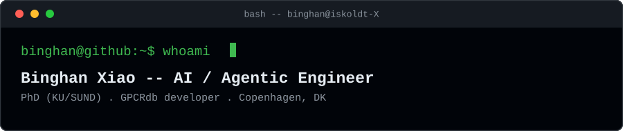
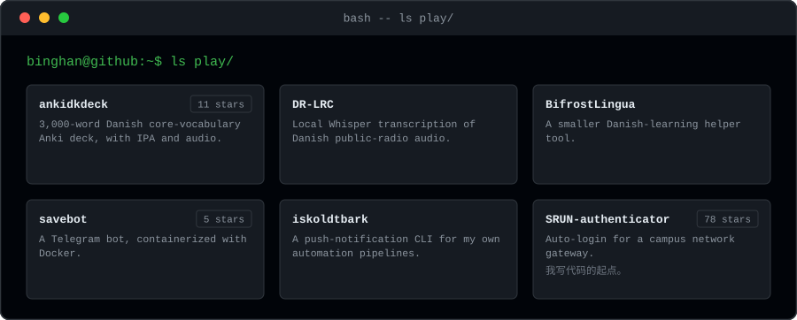

<!--
  Maintenance notes.

  The four pictures are generated: python3 scripts/gen_profile.py
  Their text lives in that script (PANES, TREE, TILES), not in this file.
  assets/header.svg is the exception -- hand-authored, no script touches it.
  Hand edits to the other three are lost the next time the generator runs.

  Design constraints behind the pictures, so they do not get undone by accident:
  - ONE set of images, no #gh-light-mode-only / #gh-dark-mode-only. That switch
    follows each viewer's own environment, which cannot be controlled from here,
    so a viewer whose GitHub theme is pinned opposite to their OS would see a
    dark card on a white page. Every block is a self-contained terminal window
    instead, and reads the same on either background.
  - Native <rect>/<circle>/<text> only, no <foreignObject>.
  - Heights are computed from the wrapped line count, so text cannot overflow.
  - ASCII tree characters, so a missing glyph cannot render as a tofu box.
-->

**I build software for bioinformatics, computational drug discovery and structural
biology. Most recently an AI-driven annotation pipeline where I designed a voting system, and deterministic
validators that overrule the AI. Open to AI / agentic engineering, data engineering,
data science and scientific software roles in the Copenhagen area.**

---

## `$` whoami

I'm a PhD researcher (Drug Design & Pharmacology, University of
Copenhagen / SUND) and a GPCRdb developer. GPCRdb is the reference database
for a receptor family that's the target of roughly a third of approved
drugs, and I build the software behind it. Lately that includes an AI
layer that has to earn a scientist's trust field by field, not just look
good in a demo -- deterministic validators, audit trails, human-in-the-loop
review.

---

## Flagship work

**GPCR Annotation Tools** is an AI-driven annotation pipeline for GPCR structural
data. Gemini proposes each field; a chain of deterministic validators can
overrule any of them against an external database or a computed value, and
every override is logged for human review. Started as a fork of the GPCRdb
team's repository, all 214 commits are mine, 8 PRs merged upstream. Being
deployed into GPCRdb; NAR manuscript submitted (first author).
[repository](https://github.com/iskoldt-X/GPCR-annotation-tools) &nbsp;&middot;&nbsp;
[merged PRs](https://github.com/protwis/GPCR-annotation-tools/pulls?q=is%3Apr+author%3Aiskoldt-X)

The container platform GPCRdb runs on. Django + RDKit-PostgreSQL,
health-check-gated startup, multi-architecture images, and a
**36-cell Python x Django x RDKit compatibility matrix** that runs
automatically in CI on every push. Ten of my PRs are merged into
`protwis/protwis` (43 stars, 75 forks).
[merged PRs](https://github.com/protwis/protwis/pulls?q=is%3Apr+author%3Aiskoldt-X+is%3Amerged) &nbsp;&middot;&nbsp;
[protwis_django_docker](https://github.com/protwis/protwis_django_docker) &nbsp;&middot;&nbsp;
[postgres_rdkit_docker](https://github.com/protwis/postgres_rdkit_docker)

---

## More

**A pre-computation pipeline for molecular modeling** runs as a private
codebase, with staged jobs on an HPC cluster under SLURM for the licensed
Schrodinger Suite, explicit contracts between stages, idempotent and
resumable, and about 250 automated tests plus a golden-fixture regression
suite that catches drift after a vendor upgrade. No public repository to
link.

**LSTM models over 15.6 million viral genomes**, from my MSc research --
sequence models in PyTorch, trained on HPC, tracking SARS-CoV-2
evolutionary dynamics across the full GISAID corpus.
[paper (DOI)](https://doi.org/10.1016/j.gene.2024.148426) &nbsp;&middot;&nbsp;
[code snapshot](https://github.com/iskoldt-X/SARS-CoV-2-dynamic-evolution)
(*Gene*, 2024, 916:148426, first author)

I co-developed **Plasmer** as third author, a Random Forest classifier for
plasmid host-range prediction that other labs now run in production
(*Microbiology Spectrum*, 56 citations, 1,100+ Docker pulls).
[repository](https://github.com/nekokoe/Plasmer)

---

## AI at work, AI at play

[ankidkdeck](https://github.com/iskoldt-X/ankidkdeck)

A 3,000-word Danish core-vocabulary Anki deck generated with IPA and audio.

[DR-LRC](https://github.com/iskoldt-X/DR-LRC)

Local Whisper transcription of Danish public-radio audio into subtitles.

[BifrostLingua](https://github.com/iskoldt-X/BifrostLingua)

A smaller Danish-learning helper tool.

[savebot](https://github.com/iskoldt-X/savebot)

[iskoldtbark](https://github.com/iskoldt-X/iskoldtbark)

A
push-notification CLI for my own automation pipelines.

[SRUN-authenticator](https://github.com/iskoldt-X/SRUN-authenticator)

Auto-login for a campus network gateway, and where my coding
started.

---

## Stack

**Core**

**AI / ML**

**Cloud (used, not deep)**

---

If you're building AI that has to earn trust in a regulated or scientific
setting, I'd like to hear about it -- reach out here on GitHub.

